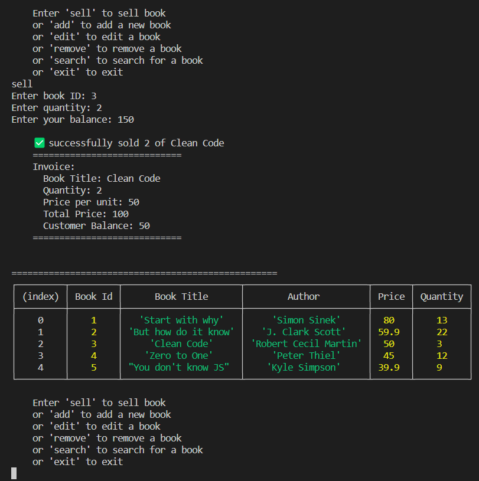
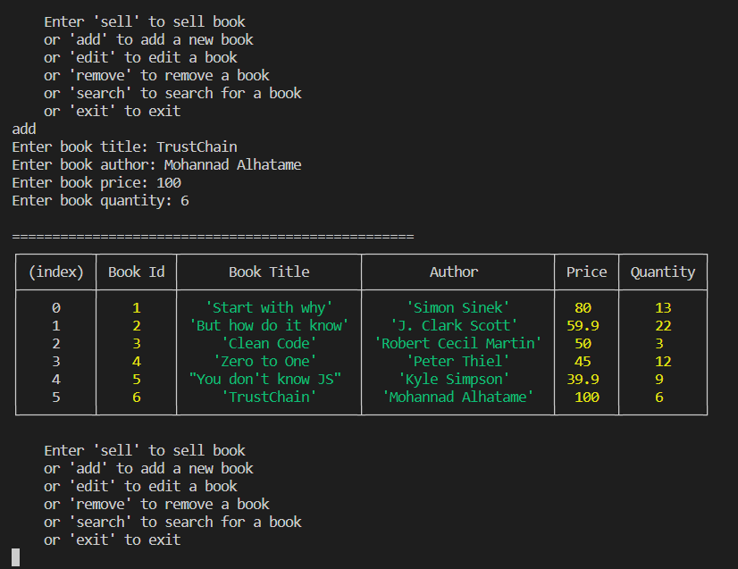
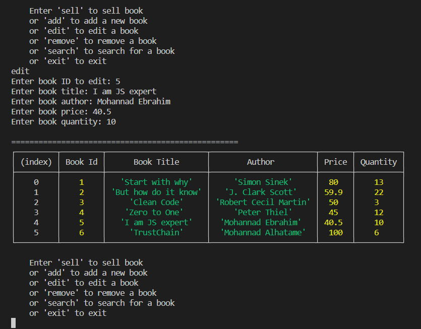
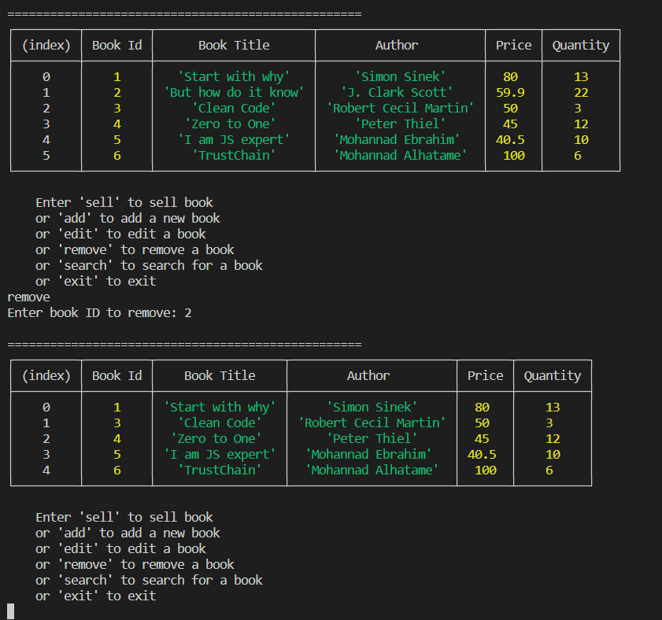
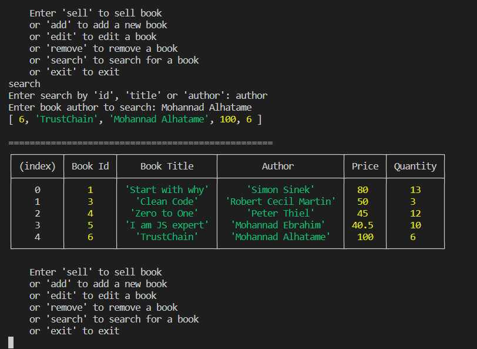
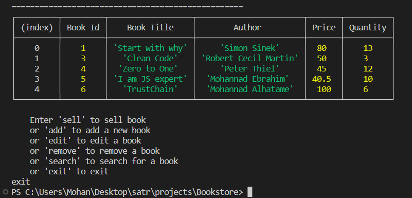

## Bookstore Project (JS101)

This is the first project in the summer training at Taibah Valley.
Project requirements are available on the satr platform in this [link](https://satr.codes/courses/063df133-5593-44b9-8d87-a63f2b150fab/session/b4dcd4d2-c4a1-4b04-946b-384f9b68e60b/view).

## Outputs

The following are the expected outputs of running the code:

- **Sell Book**

- **Add Book**

- **Edit Book**

- **Remove Book**

- **Search Book**

- **Exit**

