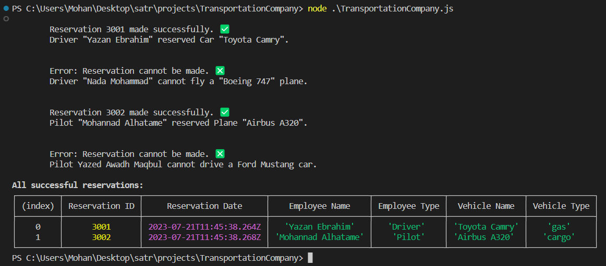

## Transportation Company Project (JS102)

This is the second project in the summer training at Taibah Valley.

Project requirements are available on the satr platform in this [link](https://satr.codes/courses/b50503d8-71a2-4b1b-96d2-7128104179b4/session/2e996f4f-a39e-4c73-9d9f-a4d547cd3c62/view).

## Output

The following is the output of running the code:

- **Run**

