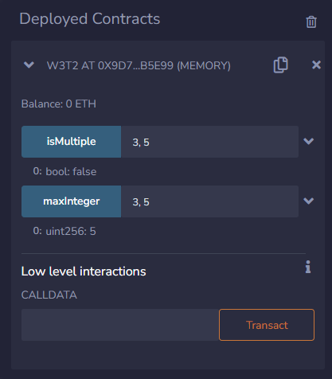

## Week 3  |  Task 2

This is the second Task from Week 3 in the summer training at Taibah Valley.

Task requirements are available on [this file](./week3Task2.pdf).

## Outputs

The following is the outputs of running the code in Remix:

- **Example 1**

- **Example 2**

