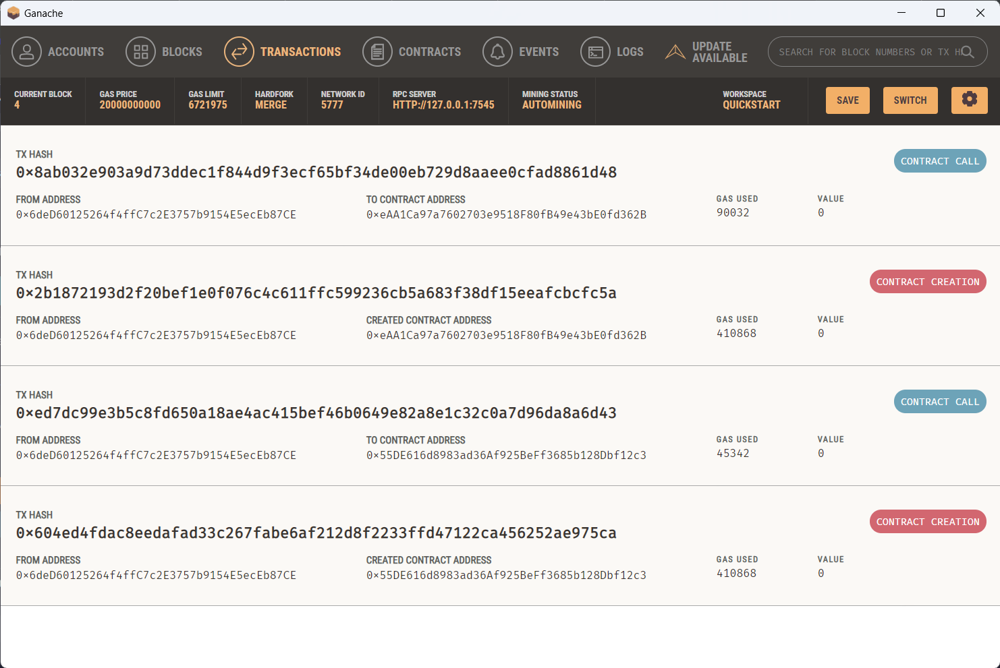

## Week 3  |  Task 3

This is the third  Task from Week 3 in the summer training at Taibah Valley.

This task is divided into two parts:
1. The first part connect Ganache to the Remix IDE
2. The second part is to deploy a smart contract with wallet provider

## Part 1: Connect Ganache to the Remix IDE

We will first with run Ganache from the `QUICKSTART` option:


Then the local network will be created with fake accounts and balance.


To connect Ganache with Remix and use these accounts, we go to the `DEPLOY & RUN TRANSACTIONS` tab, and then from the `ENVIRONMENT` menu, choose `Dev - Ganache Provider`.


We must use the same `RPC SERVER`  as Ganache:


After that, we will get all accounts in the `ACCOUNT` list:


Now we will deploy the following [Smart Contract](./W3T3.sol) using one of the accounts in the previous list:
```
contract W3T2 {
    string private message;
    
    // Set the message
    function setmessage(string memory _message) public {
        message = _message;
    }
    
    // Get the message
    function getmessage() public view returns (string memory) {
        return message;
    }
}
```

Once the smart contract is deployed, we can send transactions to the smart contract using the previous accounts.


And Ganache displays all transactions under the `TRANSACTIONS` tab.


<br>

## Part 2: Deploy a smart contract with wallet provider (Metamask)

In this part we will deploy smart contract in Remix using `MetaMask` wallet.

We will first import an account from Ganache into our wallet using `private key`.


Then we change the network in Metamask to Ganache (or add it manually).


When successfully importing the account, we can deploy the contract with the wallet from Remix by selecting `Injected Provider - MetaMask` from the `ENVIRONMENT` menu in the `DEPLOY & RUN TRANSACTIONS` tab.


Now we can press the Deploy button and it will ask us to confirm the transaction from the Meta Mask wallet.


Also we will need to confirm any transaction before sending it.


And Our wallet allows us to perform all smart contract functions.


Finally we can check all the transactions in Ganache under the `TRANSACTIONS` tab.

